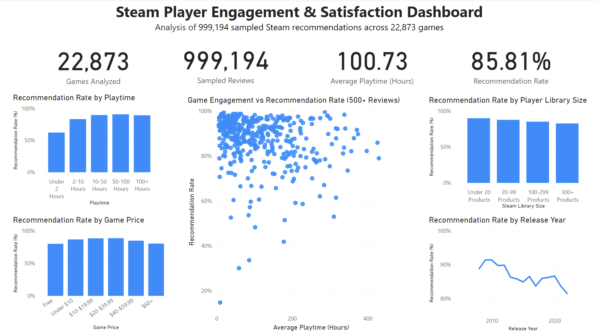

# Steam Player Engagement & Satisfaction Analysis

SQL and Power BI analysis of Steam player engagement, recommendation behavior, and game performance.



## Project Overview

This project analyzes Steam player engagement and recommendation behavior using PostgreSQL, SQL, and Power BI.

The source dataset contains more than 41 million Steam recommendation records along with game and user information. Because working with the full recommendation dataset was unnecessary for portfolio analysis, I developed and validated a randomized sample of approximately 1 million recommendation records.

The final analytical sample contains:

- **999,194 recommendation records**
- **22,873 games**
- Player-level information linked through Steam user IDs
- Game-level information including price, release date, review metrics, and Steam Deck compatibility

The analysis focuses on how player engagement, game price, library size, release year, and individual game performance are associated with recommendation behavior.

---

## Business Questions

The project was designed around five main analytical questions:

1. How is player engagement associated with recommendation behavior?
2. Do recommendation rates differ across game price segments?
3. Do players with larger Steam libraries behave differently from players with smaller libraries?
4. Which games combine high player engagement with strong recommendation rates?
5. How have recommendation rates varied across game release-year cohorts?

---

## Tools Used

- **PostgreSQL** – database creation, storage, joins, aggregation, and analytical views
- **SQL** – exploratory analysis, segmentation, data validation, and dashboard preparation
- **DBeaver** – PostgreSQL database management and SQL development
- **Power BI** – dashboard development, DAX measures, and data visualization

### SQL concepts demonstrated

- Multi-table `JOIN`s
- Common Table Expressions (`CTE`s)
- `CASE` statements
- Aggregate functions
- `GROUP BY` and `HAVING`
- Window functions with `NTILE()`
- Data validation queries
- Index creation
- SQL views
- Segmentation and ranking

---

## Data Preparation & Sampling

The original recommendation dataset contains more than **41 million records**.

An initial development sample was created by selecting the first 1 million recommendation rows. During validation, I discovered that this sample represented only **213 unique games**, indicating that the source file was ordered in a way that created substantial sampling bias.

Rather than continue with a biased sample, I replaced it with a randomized sample.

### Initial Sample

- Approximately 1 million recommendation records
- Only **213 unique games**
- Strongly influenced by the ordering of the source file

### Final Randomized Sample

- **999,194 recommendation records**
- **22,873 unique games**
- Much broader representation of the Steam catalog

All final analysis and dashboard results use the randomized sample.

This sampling correction became an important part of the project because it demonstrated the need to validate a dataset before interpreting analytical results.

---

## Data Model

The analysis uses three primary PostgreSQL tables:

### `games`

Contains game-level information including:

- Game ID
- Title
- Release date
- Price
- Steam positive ratio
- Review volume
- Platform support
- Steam Deck compatibility

### `recommendations`

Contains player recommendation activity including:

- Game ID
- User ID
- Review ID
- Recommendation outcome
- Playtime hours
- Review date

### `users`

Contains user-level information including:

- User ID
- Number of products owned
- Number of reviews written

The tables are connected using `app_id` and `user_id`.

---

## Analysis

### 1. Player Engagement and Recommendation Behavior

Players were segmented according to playtime:

- Under 2 hours
- 2–10 hours
- 10–50 hours
- 50–100 hours
- 100+ hours

Recommendation rates increased substantially as playtime increased.

| Playtime Segment | Recommendation Rate |
|---|---:|
| Under 2 Hours | 62.12% |
| 2–10 Hours | 83.16% |
| 10–50 Hours | 89.55% |
| 50–100 Hours | 90.71% |
| 100+ Hours | 89.19% |

Recommendation rates rise sharply at lower engagement levels before leveling off among players with 50 or more hours.

This should be interpreted as an **association rather than a causal relationship**. Players may spend more time with games they already enjoy.

---

### 2. Game Price and Recommendation Rate

Games were grouped into six price segments.

| Price Segment | Recommendation Rate |
|---|---:|
| Free | 79.95% |
| Under $10 | 86.65% |
| $10–$19.99 | 88.33% |
| $20–$39.99 | 88.54% |
| $40–$59.99 | 84.72% |
| $60+ | 80.29% |

The strongest recommendation rates occurred among games priced between approximately **$10 and $40**.

However, average playtime did not follow the same pattern. This suggests that higher engagement and higher satisfaction are not necessarily interchangeable.

---

### 3. Player Library Size

Users were segmented based on the number of Steam products they owned.

| Library Size | Average Playtime | Recommendation Rate |
|---|---:|---:|
| Under 20 Products | 141.24 hours | 89.80% |
| 20–99 Products | 112.46 hours | 87.56% |
| 100–299 Products | 98.44 hours | 85.05% |
| 300+ Products | 69.21 hours | 82.54% |

Players with smaller libraries showed both higher average playtime per reviewed game and higher recommendation rates.

One possible interpretation is that players with larger libraries distribute their attention across more games or may be more selective when recommending titles.

---

### 4. High-Engagement, High-Satisfaction Games

Game-level metrics were calculated using:

- Sampled review count
- Average playtime
- Recommendation rate

To identify strong-performing games, titles with at least 100 sampled reviews were divided into quartiles using the SQL `NTILE()` window function.

Games appearing in both the:

- Top 25% for average playtime
- Top 25% for recommendation rate

were classified as high-engagement, high-satisfaction titles.

Examples included games such as:

- Terraria
- RimWorld
- Factorio
- Stardew Valley
- Deep Rock Galactic
- Euro Truck Simulator 2
- BeamNG.drive
- Slay the Spire

The Power BI scatter plot uses a stricter threshold of **500+ sampled reviews** to improve visual clarity and emphasize games with stronger sample representation.

---

### 5. Recommendation Rate by Release Year

Recommendation rates were also analyzed across release-year cohorts.

To reduce instability from years represented by only a few games, the final release-year analysis requires:

- At least **1,000 sampled reviews**
- At least **100 distinct games** within the release year

The analysis shows differences in recommendation rates across release cohorts, including a general decline among several more recent cohorts in the sample.

---

## Data Quality Investigation

During the analysis, I identified **72,704 recommendation records** where the recommendation date occurred before the game's listed release date.

These records represented:

- **2,141 games**
- Approximately **7.3% of the analytical sample**

Investigation showed that many of the affected games were titles with substantial Early Access periods, including examples such as:

- Rust
- Factorio
- Mount & Blade II: Bannerlord
- Baldur's Gate 3
- Unturned
- Space Engineers

For this reason, these observations were not automatically treated as invalid.

Instead, the project interprets `date_release` as the game's listed full-release date, while recommendation activity may include legitimate Early Access activity.

Release-year analysis is therefore limited to games with listed release years through **2022**, matching the time coverage of the recommendation dataset.

---

## Power BI Dashboard

The final dashboard includes four KPI metrics:

- **22,873 Games Analyzed**
- **999,194 Sampled Reviews**
- **100.73 Average Playtime Hours**
- **85.81% Recommendation Rate**

The dashboard also includes:

- Recommendation Rate by Playtime
- Recommendation Rate by Game Price
- Recommendation Rate by Player Library Size
- Game Engagement vs. Recommendation Rate
- Recommendation Rate by Release Year

The game-level scatter plot is filtered to titles with at least **500 sampled reviews** to reduce visual noise and emphasize better-supported observations.

---

## Dashboard Data Pipeline

The project follows this workflow:

```text
Raw Steam CSV Files
        ↓
PostgreSQL Database
        ↓
Data Validation
        ↓
Randomized Recommendation Sample
        ↓
Exploratory SQL Analysis
        ↓
Dashboard SQL Views
        ↓
Power BI Dashboard
```

Five PostgreSQL views were created specifically for Power BI:

```text
vw_game_performance
vw_playtime_segments
vw_price_segments
vw_player_segments
vw_release_year
```

This approach keeps most transformation and aggregation logic inside PostgreSQL while allowing Power BI to focus primarily on visualization and presentation.

---

## Key Findings

- Recommendation rates increase strongly with player engagement before leveling off at higher playtime levels.
- Games priced between roughly **$10 and $40** produced the strongest recommendation rates among the analyzed price segments.
- Players with smaller Steam libraries showed higher average playtime and recommendation rates than users with larger libraries.
- High-performing titles can be identified by evaluating engagement and recommendation behavior together rather than relying on a single metric.
- Release-year analysis requires caution because Steam activity may begin during Early Access before the listed full-release date.
- Validating the sampling methodology materially changed the quality of the analysis: the original first-million sample represented only 213 games, while the randomized sample represented 22,873.

---

## Limitations

This analysis has several important limitations:

- The final analysis uses a randomized sample rather than all 41+ million recommendation records.
- Recommendation records represent Steam reviewers and should not be interpreted as the complete Steam player population.
- Playtime and recommendation behavior are associated, but the analysis does not establish causation.
- Game price reflects the dataset's recorded price and may not represent the price paid by every player.
- The Steam dataset also contains some non-game software and applications.
- Some games received recommendation activity during Early Access before their listed full-release date.
- The dataset does not contain game sales or revenue, so recommendation and engagement metrics should not be interpreted as measures of commercial success.

---

## Repository Structure

```text
steam-player-engagement-analysis/
│
├── README.md
├── Steam_Dashboard.png
├── Steam_Player_Engagement_Dashboard.pbix
│
└── SQL Scripts/
    ├── 01_initial_sample_analysis.sql
    ├── 02_random_sample_analysis.sql
    └── 03_dashboard_views.sql
```

### SQL Scripts

**01_initial_sample_analysis.sql**

Initial database creation, validation, exploratory analysis, and evaluation of the first 1-million-row sample.

**02_random_sample_analysis.sql**

Analysis using the randomized recommendation sample, including player engagement, price segmentation, game performance, player segmentation, window functions, and release-date validation.

**03_dashboard_views.sql**

Creates the PostgreSQL summary views used by the Power BI dashboard.

---

## Project Takeaway

This project demonstrates an end-to-end analytics workflow using **SQL, PostgreSQL, and Power BI**.

Beyond producing a dashboard, the project required validating the sampling methodology, identifying data-quality issues, joining large relational datasets, developing reusable SQL views, and translating analytical results into business-oriented visual insights.
